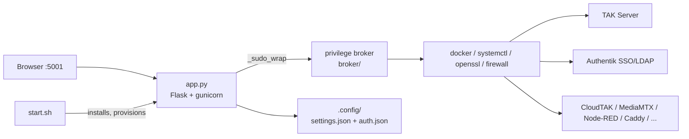

# infra-TAK Architecture

A map for reading (and contributing to) this codebase. If your first reaction to
`app.py` was *"that's one big file"* — correct, and it's deliberate in one way,
historical in another. This page explains which is which, how the code is
actually organized, and where it's headed.

## The monolith is the product

infra-TAK is a **single-service appliance**: one clone, one systemd unit
(`takwerx-console`), one password, one port (`:5001`). That deployment shape is
the point — it's what makes "no more SSH" possible:

- **Universal recovery** is `git fetch && git checkout` (see README). No build
  step, no dependency graph of services to resurrect.
- **One auditable surface** for CJIS-class deployments: one process, one auth
  path, one log stream.
- The console **orchestrates** the heavy services (TAK Server, Authentik,
  CloudTAK, MediaMTX, Node-RED, …) as Docker containers and system packages —
  those already run as separate processes. Splitting the *console* into
  microservices would add distributed-system failure modes to a product whose
  job is eliminating operational complexity on a single box.

So: monolith **deployment** is a feature. The 70k-line **file** is history — it
grew one field emergency at a time — and it is being decomposed (see
[Where this is headed](#where-this-is-headed)).

## The big picture



| Piece | Role |
|---|---|
| `start.sh` | Installer/bootstrapper: OS detection, deps, venv, cert, systemd unit, non-root provisioning. Run once (idempotent). |
| `app.py` | The entire console backend + UI: ~400 routes, deploy engines, health checks, server-rendered pages. |
| `broker/` | Root-privilege broker. The console runs as user `takwerx`; privileged commands route through the broker via `_sudo_wrap()`. |
| `.config/` | All state. JSON files, mode 600. **There is no database.** |
| `nodered/` | Flow generator (`build-flows.js`) + deploy pipeline for the data-integration engine. |
| `scripts/` | Standalone operator tools (Guard Dog monitors, diagnostics). |
| `cloudtak-plugins/` | CloudTAK browser-plugin sources (today's main extension point). |
| `static/` | Shared JS/assets for a few of the heavier pages. |

## Finding anything in app.py

Routes are grouped by URL prefix — **one prefix per module**. To find a
feature's backend, grep the prefix, not the feature name:

```bash
grep -nE "@app.route\('/api/takserver" app.py     # TAK Server module (~78 routes)
grep -nE "@app.route\('/api/cloudtak" app.py      # CloudTAK module
grep -n "def run_mediamtx_deploy" app.py          # a module's deploy engine
```

Prefixes: `takserver`, `authentik`, `cloudtak`, `fedhub`, `caddy`, `nodered`,
`mediamtx`, `tak-video-restreamer`, `emailrelay`, `takportal`, `guarddog`,
`fail2ban`, `firewall`, `connectivity`, `netbird`, `webodm`, `cesium-tiles`,
`hardening`, `remote-assist`, `console`, `update`, and friends. Each module
family also owns a `run_<module>_deploy()` background engine and a
`<MODULE>_TEMPLATE` page constant.

Every `/api/*` route is guarded by the `@login_required` decorator.

## The seams (read this before writing code)

The codebase's core discipline is a small set of **abstraction seams** —
high-level code must not know platform or privilege details
(the Dependency Rule). Bypassing a seam is a review failure:

| Seam | Use | Never |
|---|---|---|
| `_pkg_install` / `_pkg_remove` | package installs on apt **and** dnf | bare `apt-get` / `dnf` |
| `_fw_allow` / `_fw_remove` / `_fw_backend` | firewall rules on ufw **and** firewalld | bare `ufw` / `firewall-cmd` |
| `_sudo_wrap(cmd)` | every privileged shell-out (root / sudo / broker — caller doesn't care) | raw `sudo`, assumed-root |
| `os_type` / `_host_arch()` | OS-family and arch branching (`debian`/`rhel`, x86/ARM64) | hardcoded distro paths |
| `load_settings()` / `save_settings()` | all state reads/writes | hand-rolled JSON I/O |
| `_ssh_probe(...)` | remote-box execution (split-server deploys) | ad-hoc ssh |

These seams are why one codebase ships identically to **Ubuntu 22.04,
Rocky/RHEL 9, and ARM64**. A mechanical pre-merge ratchet enforces that the
count of seam bypasses only ever goes down.

## Extending infra-TAK today

There are two extension points. **Marketplace modules** (`modules/<key>.py` +
`templates/<key>.html`, registered through the module registry in
`modules/__init__.py`) deploy and manage a whole application; the contract is
written up in [docs/MODULE-DEVELOPMENT.md](docs/MODULE-DEVELOPMENT.md).

The other is **CloudTAK plugins**: a catalog entry in
`app.py` (`CLOUDTAK_PLUGINS`) pointing at a repo with a `plugin/` (Vue, bundled
into CloudTAK's web UI) and optionally a `server/` proxy route. Install,
detection, update, and rebuild are handled generically by the console.

## Where this is headed

The decomposition is planned and sequenced (registry-first, then files —
splitting duplicated code just multiplies it):

1. **Templates out of app.py** — ✅ done in v10.1.19: the 25 inline HTML pages
   moved byte-identically to `templates/*.html` (rendered via `render_template`).
   Shared base styling (`base.html`/Jinja inheritance) is the follow-up, kept
   separate because it changes rendered bytes.
2. **A module registry** — the per-module deploy/status/control/uninstall
   plumbing (today hand-written per module) collapses into one generic engine
   driven by a declarative registry, the same pattern `CLOUDTAK_PLUGINS`
   already proves. New modules become *a descriptor + a deploy function* —
   including, eventually, out-of-tree contributor modules.
3. **File split** — with duplication gone, module families move to their own
   files along the existing URL-prefix boundaries. Size budget: no source file
   over ~3,000 lines, mechanically enforced.

The deployment model — one clone, one service, git-checkout recovery — does not
change at any step.
